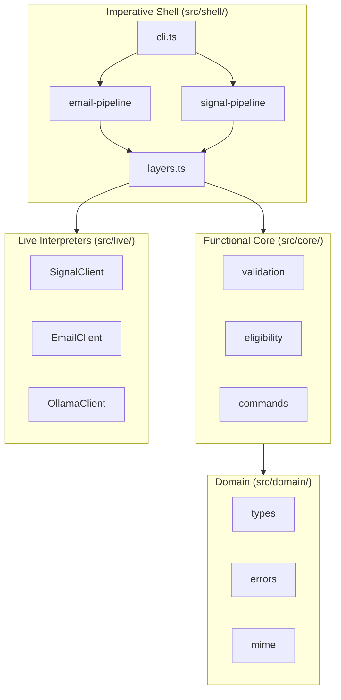
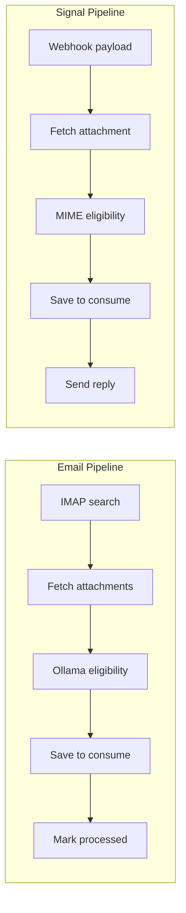

# Architecture

Bleeding edge: this project uses the latest [Effect](https://effect.website/) version (v4 beta). Expect occasional breaking changes as Effect stabilizes.

## High-Level Structure



## Main Flows (Mermaid)



## Where to Start

- **Entry point:** [`src/cli.ts`](../src/cli.ts) — parses args, delegates to pipelines.
- **Email pipeline:** [`src/shell/email-pipeline.ts`](../src/shell/email-pipeline.ts) — IMAP crawl, eligibility, save.
- **Signal pipeline:** [`src/shell/signal-pipeline.ts`](../src/shell/signal-pipeline.ts) — webhook server, attachment handling, account commands.
- **Layer composition:** [`src/shell/layers.ts`](../src/shell/layers.ts) — builds `SignalAppLayer` and `EmailLayer`.

## Functional Core / Imperative Shell (FC/IS)

- **`src/cli.ts`** — CLI entry point. Parses args, delegates to pipelines.
- **`src/shell/`** — Imperative shell. Pipelines orchestrate I/O and call core. Config, layers.
- **`src/core/`** — Pure functions only. No Effect, no I/O. Returns `Result` for sync validation.
- **`src/domain/`** — Types, errors, MIME utilities. Shared by core and shell.
- **`src/interfaces/`** — Tagless Final service interfaces. Abstract contracts for I/O.
- **`src/live/`** — Live interpreters. Implements interfaces for production.
- **Config** — JSON. Resolution: `--config` or default path. 12-factor: only individual values override via env.

**Container flow:** `Result` (core) → `Effect` (shell). Bridge with `Effect.fromResult`.

**Dependency direction:** `core` and `domain` have no dependencies on `shell`, `interfaces`, or `live`. `shell` depends on `core`, `domain`, `interfaces`, and `live`.

**Effect unstable:** CLI uses `effect/unstable/cli`; HTTP server uses `effect/unstable/http`. See [EFFECT_UNSTABLE_PLAN.md](EFFECT_UNSTABLE_PLAN.md) for adoption roadmap.

## Where to Put X

| Adding…                                    | Put in                          |
| ------------------------------------------ | ------------------------------- |
| Pure validation, search, eligibility logic | `src/core/`                     |
| New I/O or external API                    | `src/interfaces/` + `src/live/` |
| Domain type, error, or MIME utility        | `src/domain/`                   |
| Pipeline step, config, layer wiring        | `src/shell/`                    |

## Main Flows

**Email:** IMAP search → fetch attachments → eligibility (Ollama) → save to consume dir → mark processed. See [`email-attachments.ts`](../src/shell/email-attachments.ts) for fetch/eligibility/save; [`email-pipeline.ts`](../src/shell/email-pipeline.ts) for orchestration. On IMAP auth failure, [`credential-failure.ts`](../src/shell/credential-failure.ts) sends a throttled Signal notification to the account owner.

**Signal:** Webhook payload → fetch attachment → eligibility (MIME) → save to consume dir → send reply. See [`signal-pipeline.ts`](../src/shell/signal-pipeline.ts) for `processWebhookPayload` and account commands.

## Config

JSON config. Schema-based validation in [`src/shell/config.ts`](../src/shell/config.ts). `RawSignalConfigSchema` and `RawEmailConfigSchema` define the shape; shared fields (`consume_dir`, `signal_api_url`, etc.) plus pipeline-specific fields (Signal: `webhook_host`, `webhook_port`; Email: `ollama_url`, `ollama_vision_model`, etc.). Config as service — pipelines `yield* SignalConfig` / `yield* EmailConfig`.

**Resolution:** `--config` or `PAPERLESS_INGESTION_CONFIG` or default path. `loadConfiguration(schema, configPath)` loads from file, applies env overrides (12-factor: individual vars like `PAPERLESS_INGESTION_SIGNAL_API_URL` override file values), and decodes with the given schema.

**Ingest users:** Always in separate file. Path from `--users` or `PAPERLESS_INGESTION_USERS_PATH` (default: `/var/lib/paperless-ingestion-bot/users.json`).

**JSON Schema:** Emitted at build time to `dist/config.schema.json` via `scripts/generate-schema.ts`.

**Startup validation (Signal):** Before starting the webhook server, validates `consume_dir` (exists + writable) and `signal_api_url` (reachability). Use `--skip-reachability-check` to bypass the API check.

**Paths:** config.json → `--config` or `PAPERLESS_INGESTION_CONFIG`; users.json → `--users` or `PAPERLESS_INGESTION_USERS_PATH`; email-accounts.json → `--email-accounts` or `PAPERLESS_INGESTION_EMAIL_ACCOUNTS_PATH`. Loaded via [`runtime.ts`](../src/shell/runtime.ts) (`loadAllAccounts`, `saveAllAccounts`).

**Consume dir layout:** `consumeDir/{userSlug}/` — each user has a subdir. Email: slug from email; Signal: `consume_subdir` from users.json.

## Configuration vs user-generated data

| Kind | Files | Set by | Examples |
|------|-------|--------|----------|
| **Configuration** | config.json (infra), users.json (registry) | Admin/deployer | consume_dir, signal_api_url, --users, --email-accounts, webhook_port |
| **User-generated data** | email-accounts.json | Users via `gmail add` | Gmail accounts, pause/resume/remove state |

Config is split: config.json has infra only; users.json is always a separate file (path from `--users` or env). Env vars override config.json. User-generated data is loaded/saved at runtime; passwords in OS keyring.

## Gmail vs Generic IMAP (ADT + Match.exhaustive)

Email accounts support Gmail and generic IMAP. The design uses a discriminated union and `Match.exhaustive`:

- **ConnectionDetails** (`domain/account.ts`): `GmailDetails | GenericImapDetails`. Gmail has `type: "gmail"`; generic has `type: "generic_imap"` plus `host`, `port`, `secure`, `mailbox`.
- **detailsToImapConfig**: Converts JSON details → `ImapProviderConfig`. Uses `Match.value(details).pipe(Match.when({ type: "gmail" }, ...), Match.when({ type: "generic_imap" }, ...), Match.exhaustive)`.
- **imapConfigToDetails**: Converts `ImapProviderConfig` → details for serialization. Uses `Match.value(imapConfig.provider).pipe(Match.when("gmail", ...), Match.when("generic", ...), Match.exhaustive)`.

Adding a new provider (e.g. Outlook) requires extending the union and adding a `Match.when` case; `Match.exhaustive` forces compile-time exhaustiveness. Gmail uses X-GM-RAW search and labels; generic uses standard IMAP search and flags. See [`domain/imap-provider.ts`](../src/domain/imap-provider.ts) for presets.

## Services (Tagless Final)

Abstract interfaces in `interfaces/`, live interpreters in `live/`:

- `SignalClient` — Signal API
- `EmailClient` — IMAP
- `OllamaClient` — document assessment
- `CredentialsStore` — credential storage (OS keyring)
- `SignalConfig`, `EmailConfig` — config layers

Tests provide mocks via `fixtures/config`, `fixtures/credentials`, `fixtures/imap-mock`, `fixtures/signal-mock`; OllamaClient is stubbed inline with `Layer.succeed`.

## Error Model

Domain errors use `Schema.TaggedErrorClass` in [`domain/errors.ts`](../src/domain/errors.ts) (e.g. `ConfigParseError`, `ImapConnectionError`, `SignalApiHttpError`). Fail = typed domain errors; Die = defects. `formatErrorForStructuredLog` formats domain errors for logs.

## Testing

Tests swap live layers for mocks. Integration tests call pipelines directly with mock layers; no real IMAP, Ollama, or Signal API. See [test/integration/README.md](../test/integration/README.md) for fixtures, `buildTestLayer`, and how to add tests.

**Related:** [AGENTS.md](../AGENTS.md) for AI agent instructions; [EFFECT_UNSTABLE_PLAN.md](EFFECT_UNSTABLE_PLAN.md) for Effect unstable adoption; [CI.md](CI.md) for workflow structure.

## Project Structure

```
src/
  cli.ts           — CLI entry point
  core/            — Pure domain logic (FC)
  domain/          — Types, errors, MIME utilities
  interfaces/      — Tagless Final service interfaces
  live/            — Live interpreters
  shell/           — Imperative shell (pipelines, config, layers)
test/
  fixtures/        — Config mocks, credentials, imap/signal mocks
  integration/     — Integration tests
  *.test.ts        — Unit tests
```
